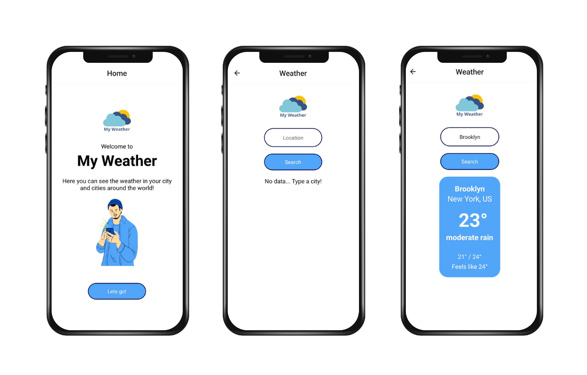

# Project MyWeather
Project developed with the goal to practice the concepts that i learned in college

## technologies used in this project:

React Native and Expo for the devepment of the components and the visual part. Node js with express for the server that interacts with the API of Open Weather!

Link of the used API:
https://openweathermap.org/api

### Mockup of the project: 

 
 

## SETUP AND EXECUTION
### Steps to setup the application

### 1:

As a first step, you need to clone this repository into an empty folder, and for that, you must open the terminal and run this code: `git clone https://github.com/JoaoSouza04/MyWeather.git`.

### 2:

After the previously step, all you have to do is to go into the repository folder you just created, through the terminal. After that, you should run this `npm i` in the root folder: `/MyWeather` and in the `/backend` folder.

#### 3:

The "last" step is to replace the `localhost` on the line: 
`const result = await axios.get(http://localhost:3000/api/weather/${location});` with the IP Adress of the network that you gonna use on your smartphone while you run and use the aplication. Note: You have to use the same network both on your computer and smartphone. 

#### 3:

And welldone!, your setup is now ready for run this application! To start the app you must open two terminals and run `npm start` in the `/backend` folder and after that, run the same command in the root folder: `/MyWeather`.

 
 

## USE
### Steps to use the application on your smartphone

### 1:

The first step is to download the Expo app on your store (Apple or Google Store) and open it!

### 2:

After that, you need to scan the QR Code of the project with the app. It will appear in one of the terminals of the project (the root one), when you start the application.

#### 3:

And you finished! now you can see and use the application without any troubles!

#### 4 (Auxiliar Step):

If the app didn't open in your expo app, you can type `r` on the terminal of the root folder `MyWeather` while the project are running. That may resolve the problem!

